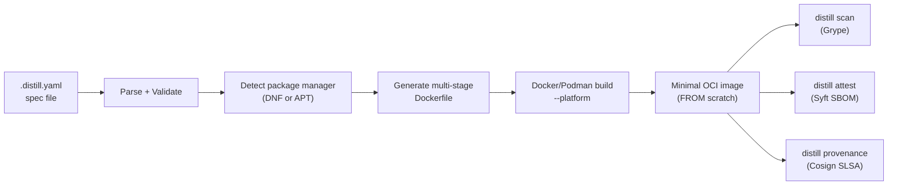
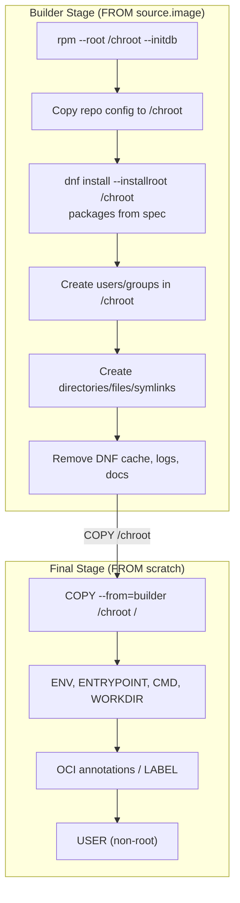
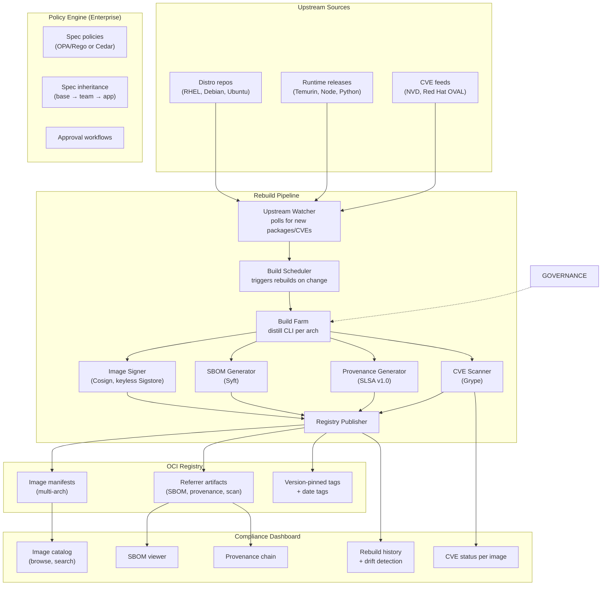
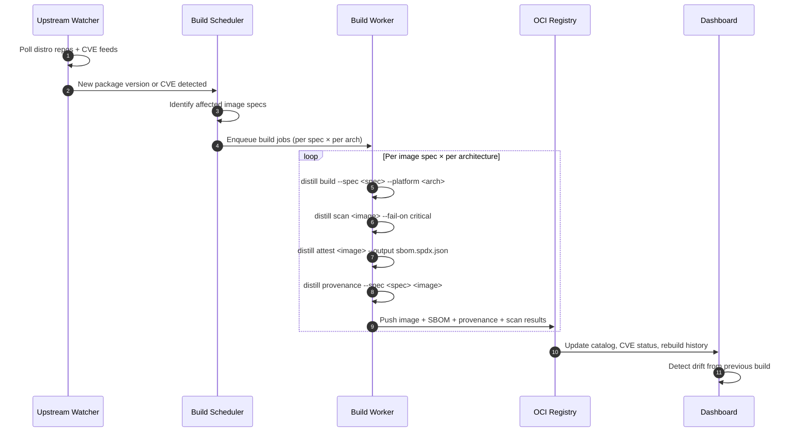
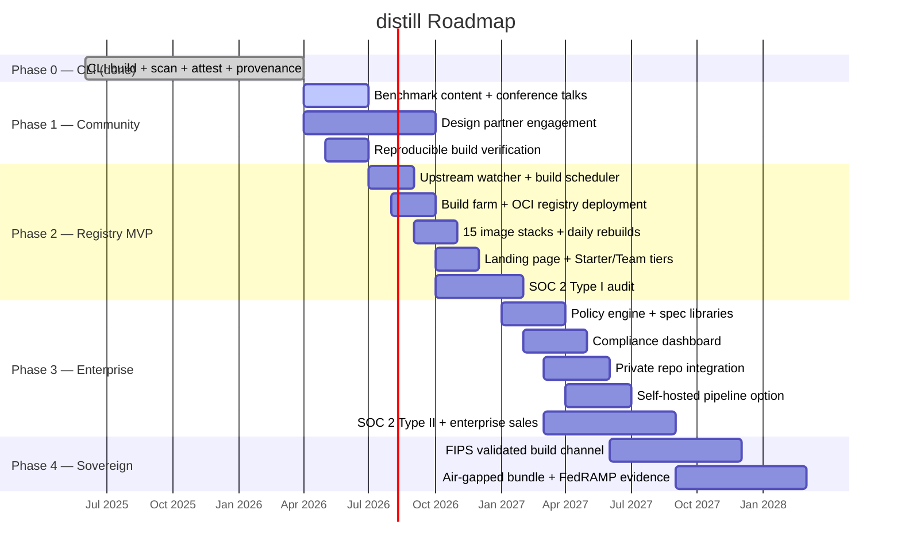

# distill — Commercial Strategy

**Date:** 2026-04-15
**Status:** Draft
**Scope:** Commercialization strategy for distill as a product company

---

## Summary

distill is an open-source CLI tool that builds minimal, immutable OCI container
images from enterprise Linux distributions (RHEL, UBI, Debian, Ubuntu). It
occupies a structural gap in the container security market: **no existing product
delivers Chainguard-style minimal images rooted in the enterprise Linux distros
that regulated industries are contractually required to use.**

The strategic bet is that Chainguard proved the market ($100M+ ARR selling
hardened container images) but structurally cannot serve the largest enterprise
segment — organizations with RHEL, UBI, or Debian mandates. Chainguard built an
entirely new distro (Wolfi) to avoid RPM/APT complexity, which means every
customer who needs "RHEL packages from Red Hat repos" is underserved.

Positioning: **"Chainguard for Enterprise Linux."** Minimal, hardened container
images built from the enterprise distributions your organization already uses and
supports.

Distribution thesis: own the "golden image" pipeline for enterprise Linux the way
Chainguard owns it for Wolfi — open-source CLI as the entry point, hosted
registry as the product, enterprise governance as the upsell.

---

## Market Trends

### Trend 1: Supply-chain regulation is accelerating

Executive Order 14028 (US), NIS2 (EU), FedRAMP Rev 5, and DORA now require
SBOMs and provenance for software artifacts. Container images are the primary
deployment unit for most organizations. Teams that cannot produce an SBOM for
their container images face audit findings.

### Trend 2: Chainguard has proven the market

Chainguard exceeded $100M ARR by 2024 selling hardened container images. This
validates that enterprises will pay for pre-built, minimal, CVE-scanned images
with SBOMs. But Chainguard's Wolfi-only approach leaves the largest segment
underserved.

### Trend 3: Enterprise Linux mandates are durable

RHEL is the dominant OS in financial services, healthcare, government, defense,
and telco. These mandates come from procurement contracts, vendor support
agreements, FedRAMP baselines, and STIG requirements. They are not going away —
if anything, compliance pressure is increasing.

### Trend 4: Platform engineering is mainstream

Internal platform teams now own the "golden image" pipeline and have both the
mandate and budget to adopt tools like distill. They are the ideal buyer —
technical enough to evaluate the CLI, senior enough to sign a contract.

### Trend 5: Container image bloat is a growing liability

The average enterprise container image ships with 200–400 packages, most unused.
Each package is a potential CVE. Security teams spend significant time triaging
vulnerabilities in packages that exist only because nobody removed them from the
base image. The problem scales linearly with fleet size.

### Trend 6: Self-hosted is back for regulated buyers

Banks, defense, healthcare, and government increasingly refuse SaaS for
infrastructure tooling. Open-core with self-hosted build capability is the
commercially viable shape — the CLI must be genuinely useful standalone.

---

## Competitive Landscape

### Product comparison

| Category | Representative Products | Gap vs. distill Opportunity |
|---|---|---|
| **Hardened image vendors** | Chainguard Images | Wolfi-based — cannot satisfy RHEL/UBI mandates; no self-hosted builds |
| **Distroless images** | Google distroless | Debian-only, not customizable, no SBOM/provenance, no declarative spec |
| **Vendor minimal images** | Red Hat ubi-micro, ubi-minimal | Single distro, single image, not customizable, no declarative spec |
| **Declarative image builders** | Chainguard apko | Alpine/Wolfi only — no RPM/APT support |
| **CVE scanning** | Docker Scout, Snyk Container, Grype | Scan existing images but don't help build minimal ones |
| **General container tools** | Docker, Podman, Buildah, ko, Jib | Build images but don't enforce minimalism or produce compliance artifacts |
| **DIY Dockerfiles** | Hand-crafted multi-stage builds | Error-prone, inconsistent, no standard spec, no SBOM/provenance |

### Competitor pricing snapshot _(approximate, as of early 2026)_

| Product | Model | Approximate Price | Notes |
|---|---|---|---|
| **Chainguard Production** | Per image stream, annual | ~$5–15k / image stream / year; catalog deals $100k+ | Free tier: ~50 images, `:latest` only, no CVE SLA |
| **Chainguard Starter** | Free | $0 | Limited catalog, no version pinning |
| **Docker Scout** | Per repo | Team $9/user/mo; Business custom | Scanning, not building |
| **Snyk Container** | Per developer | Team $25/dev/mo; Enterprise custom | Scanning, not building |
| **Red Hat OpenShift** | Per core | ~$50/core/month (varies) | Includes UBI access but not minimal image tooling |
| **Google distroless** | Free | $0 | No commercial offering |
| **Apko** | Free OSS | $0 | Chainguard's OSS builder; Wolfi/Alpine only |

**Patterns worth noting:**

- Chainguard prices per image stream — each runtime/base combination is a line
  item. Customers with 20+ stacks face $100k+ annual spend.
- CVE scanning tools (Scout, Snyk) charge per developer or per repo but don't
  solve the root cause (image bloat).
- The "free" anchor is strong — Google distroless, apko, and ubi-micro are all
  free. Any commercial model must justify the premium over self-service.
- Nobody prices on compliance artifacts (SBOM, provenance, audit trail), even
  though those are the highest-value outputs for regulated buyers.

### The whitespace

No product offers **customizable, declarative, minimal container images built
from enterprise Linux distributions (RHEL, UBI, Debian, Ubuntu) with integrated
SBOM, SLSA provenance, and CVE scanning.** The closest competitor (Chainguard)
serves a different distro ecosystem. The closest enterprise option (ubi-micro) is
a single fixed image with no customization.

---

## Selected Use Cases

Prioritized by willingness-to-pay and defensibility.

### UC1 — Golden Image Pipeline for Platform Teams (Primary Wedge)

A platform engineering team maintains 30+ microservice base images on RHEL/UBI9.
Today each team hand-crafts a Dockerfile that tries to strip down `ubi9`. Results
are inconsistent — some images ship curl, man pages, and the full DNF cache.
Security scans flag hundreds of CVEs in unused packages.

With distill, the platform team defines a `.distill.yaml` spec per image type.
Each produces a `FROM scratch` image with only the declared packages. SBOMs are
generated at build time. CVE counts drop by 80–90%.

- **Who buys:** Platform engineering leads at enterprises with >50 container
  images.
- **Why now:** Platform teams are being held accountable for image hygiene as
  supply-chain audits increase.
- **Why distill wins:** No other tool produces customizable minimal images from
  RHEL/UBI with compliance artifacts.

### UC2 — FedRAMP / STIG Container Compliance

A government contractor needs container images that meet FedRAMP Moderate
baselines and DISA STIG requirements. Auditors require: known package inventory,
SBOM, provenance, FIPS-validated crypto, and evidence that the image contains
only authorized software.

distill produces images where every package is declared in the spec, the RPM/dpkg
database is preserved for audit queries, and SBOM + SLSA provenance are attached
at build time.

- **Who buys:** Security/compliance teams at government contractors and agencies.
- **Why now:** FedRAMP Rev 5 and the new container STIG profiles demand
  artifact-level evidence.
- **Why distill wins:** Chainguard's Wolfi packages don't satisfy "must use
  RHEL" requirements. ubi-micro doesn't produce SBOMs or allow customization.

### UC3 — Language Runtime Images for Enterprise Stacks

An enterprise runs Java (Temurin), Python, and Node.js services on RHEL. They
need minimal base images for each runtime — hardened, scanned, and rebuilt when
patches land. Today they either use fat UBI images (high CVE count) or Chainguard
images (no RHEL compliance).

The distill Registry provides pre-built `java21-ubi9`, `python312-debian`,
`node22-ubuntu` images — rebuilt daily, CVE-scanned, with SBOMs.

- **Who buys:** Application platform teams at mid-to-large enterprises.
- **Why now:** Chainguard has proven demand for this exact product; distill
  serves the RHEL segment they cannot.
- **Why distill wins:** Same value proposition as Chainguard Production, but
  rooted in the distro the customer is contractually required to use.

### UC4 — Air-Gapped and Disconnected Environments

A defense contractor or intelligence agency builds container images in a
disconnected environment with no internet access. They need pre-seeded package
caches, offline SBOM generation, and a fully self-contained build pipeline.

distill Enterprise provides air-gapped build support with pre-seeded RPM/APT
caches and offline provenance generation.

- **Who buys:** Defense, intelligence, and critical infrastructure teams.
- **Why now:** Container adoption is reaching classified environments.
- **Why distill wins:** Chainguard is SaaS-only. No existing tool provides
  declarative minimal image builds in disconnected environments.

### UC5 — CI/CD Image Hardening Gate

A security team wants to enforce that every container image deployed to
production meets a minimum hardening standard: no package manager in runtime
images, SBOM attached, CVE scan below threshold, provenance signed.

distill integrates into CI/CD pipelines as a build step (replacing hand-crafted
Dockerfiles) and a scan/attest step, providing a single tool for the entire
image-hardening workflow.

- **Who buys:** DevSecOps teams implementing container security policies.
- **Why now:** "Shift left" security is moving from aspiration to requirement.
- **Why distill wins:** One tool for build + scan + attest, instead of stitching
  together Dockerfile + Grype + Syft + Cosign manually.

---

## Product Vision

### Product Tiers

#### Tier 1: distill CLI (Open Source, Free)

The existing open-source tool. This is the top-of-funnel and the trust-building
mechanism. Enterprises evaluate before buying — the CLI must be genuinely useful
standalone.

- Declarative `.distill.yaml` spec
- `FROM scratch` builds via chroot bootstrap
- Multi-distro support (RHEL, UBI, CentOS Stream, Rocky, Alma, Debian, Ubuntu)
- SBOM generation (`distill attest`)
- CVE scanning (`distill scan`)
- SLSA provenance (`distill provenance`)
- Multi-platform builds (amd64/arm64)
- `distill init` scaffolding and `distill doctor` environment checks
- Runtime installation (Node.js, Temurin JDK, Python from upstream binaries)

**Goal:** Widespread adoption, community, and trust. Every CLI download is a
future enterprise lead.

#### Tier 2: distill Registry (Commercial SaaS)

A hosted registry of **pre-built, daily-rebuilt distill images** for common
enterprise stacks:

| Stack | Base | Example Tag |
|---|---|---|
| Java 21 (Temurin) | UBI9 | `registry.distill.dev/java21-ubi9:21.0.4` |
| Java 17 (Temurin) | UBI9 | `registry.distill.dev/java17-ubi9:17.0.12` |
| Python 3.12 | Debian Bookworm | `registry.distill.dev/python312-debian:3.12.7` |
| Python 3.12 | UBI9 | `registry.distill.dev/python312-ubi9:3.12.7` |
| Node.js 22 | Ubuntu 24.04 | `registry.distill.dev/node22-ubuntu:22.11.0` |
| Go (static) | UBI9 | `registry.distill.dev/go-static-ubi9:1.23` |
| .NET 8 | UBI9 | `registry.distill.dev/dotnet8-ubi9:8.0.11` |
| nginx | Debian Bookworm | `registry.distill.dev/nginx-debian:1.27` |
| PostgreSQL 16 | UBI9 | `registry.distill.dev/pg16-ubi9:16.6` |
| Redis 7 | Debian Bookworm | `registry.distill.dev/redis7-debian:7.4` |
| Base (no runtime) | UBI9 | `registry.distill.dev/base-ubi9:9` |
| Base (no runtime) | Debian Bookworm | `registry.distill.dev/base-debian:bookworm` |

Each image includes:

- **Daily rebuilds** when upstream packages or patches land
- **Version-pinned tags** (e.g., `:21.0.4-ubi9`, `:2026-04-15`)
- **SBOM and SLSA provenance** attached to every manifest
- **CVE scan results** published alongside the image
- **RPM/dpkg database preserved** inside the image for compliance auditing
- **Multi-architecture** (amd64 + arm64) manifests

#### Tier 3: distill Enterprise (Commercial Platform)

For organizations that need governance, customization, and air-gapped support:

- **Policy engine** — org-wide rules enforced at build time (e.g., "no curl in
  production images", "all images must use UBI9", "maximum image size 50MB",
  "all specs must inherit from company-base")
- **Private repo integration** — Red Hat Satellite, Artifactory RPM/APT repos,
  RHEL subscriptions, authenticated package sources
- **FIPS-validated builds** — RHEL FIPS mode in the chroot, FIPS-validated
  crypto modules, certified build pipeline
- **Air-gapped builds** — pre-seeded package caches, offline SBOM and provenance
  generation, fully disconnected build pipeline
- **Spec libraries** — shared, versioned base specs that teams inherit from
  (e.g., `company-base-ubi9.distill.yaml` → `myapp.distill.yaml`)
- **Compliance dashboard** — SBOM history, provenance chain, CVE triage status,
  rebuild lineage, drift detection per image
- **Custom image catalog** — customers define their own image stacks, rebuilt on
  their schedule, in their registry
- **SSO, RBAC, and approval workflows** — spec changes require review before
  rebuild
- **Priority support** — named TAM, 24x7 for Sovereign tier

---

## Pricing Models and Competitive Pricing

### Candidate pricing models

| Model | Fit | Pros | Cons |
|---|---|---|---|
| **A. Per image stream** | **Strong** | Matches Chainguard model; buyer understands the unit | Low per-stream price may not cover rebuild infrastructure |
| **B. Per cluster node** | Medium | Scales with deployment size | Doesn't reflect image count; unfamiliar unit for this category |
| **C. Per team / seat** | Medium | Simple procurement | Ignores the actual value (images, not people) |
| **D. Per image pull** | Weak | Usage-based | Unpredictable; penalizes frequent deploys |
| **E. Platform fee + per image stream** | **Strong — recommended** | Predictable floor + scales with adoption | Two-variable conversation |
| **F. Catalog subscription (all-you-can-eat)** | Strong for large buyers | Simple; removes counting friction | May underprice for heavy users |

### Recommended model — tiered open-core with platform + per-stream

**Open-source CLI (free, self-hosted, forever):**

- Full build, scan, attest, provenance CLI
- All supported distributions
- Local builds, any registry
- Community support via GitHub

This is the adoption surface — it must be genuinely useful standalone, or the
distribution thesis fails.

**Starter tier — free, hosted registry:**

- Access to ~15 base images (`:latest` tag only)
- No version pinning, no CVE SLA, no support
- Rate-limited pulls
- Goal: create usage and familiarity before procurement

**Team tier — ~$30k/year floor, then per-stream:**

- Platform fee: includes 10 image streams
- $2,500 / additional image stream / year
- Version-pinned tags (e.g., `:21.0.4-ubi9`, `:2026-04-15`)
- Daily rebuilds with CVE re-scan
- SBOM + SLSA provenance on every image
- 48-hour CVE patch SLA (critical/high)
- Email support, 1-business-day response

**Enterprise tier — quote-driven, typical $80–200k/year:**

- Everything in Team
- Unlimited image streams from the catalog
- Custom image specs (customer-defined stacks rebuilt by the pipeline)
- Private registry mirror option
- Policy engine for spec governance
- Spec libraries with inheritance
- Compliance dashboard
- Red Hat Satellite / private repo integration
- 24-hour CVE patch SLA (critical/high)
- Named TAM, Slack/Teams support channel

**Sovereign tier — $250k+ floor:**

- Everything in Enterprise
- FIPS 140-3 validated build channel
- Air-gapped install bundle (offline package caches, offline signing)
- Dedicated release channel with extended support
- Compliance artifact packages (FedRAMP, STIG evidence bundles)
- On-site deployment assistance
- Annual penetration test report shared with customer

### Worked examples

- **Mid-market SaaS, 20 image streams** — Team: $30k floor + 10 additional
  streams × $2,500 = $25k → **~$55k/year**
- **Enterprise bank, 80 image streams + custom specs + compliance dashboard** —
  Enterprise: ~$150k/year (catalog + custom streams + governance)
- **Government contractor, 40 streams + FIPS + air-gapped** — Sovereign:
  **~$300k/year**
- **Small startup, 5 images, just wants pre-built** — Starter (free) or Team
  floor: **$30k/year**

### Pricing anti-patterns to avoid

- **Don't gate SBOM/provenance behind a paid tier.** These are the compliance
  win — making them paywalled for CLI users kills the trust story and prevents
  bottom-up evaluation.
- **Don't price per pull.** Penalizes frequent deploys and makes costs
  unpredictable. Chainguard doesn't do this; neither should we.
- **Don't charge for the CLI.** The CLI is the adoption surface. Gating it
  behind payment kills distribution.
- **Don't bundle too many things into "Enterprise."** Keep Team genuinely useful
  for teams that just want pre-built images. Enterprise should be for governance
  and customization, not for basic functionality.
- **Don't compete on price with free tools.** The value is the rebuild pipeline,
  CVE SLA, and compliance artifacts — not the images themselves. Price
  accordingly.

### Pricing roadmap

- **Phase 1 (CLI adoption):** OSS only. No commercial SKU. Goal: 5,000 GitHub
  stars, design partner pipeline.
- **Phase 2 (Registry launch):** Starter (free) + Team tier. First 5 paying
  customers at discounted $20k/year design-partner rate.
- **Phase 3 (Enterprise):** Launch Enterprise tier. First 3 enterprise customers
  at $80–120k/year.
- **Phase 4 (Sovereign):** Launch only when a concrete FedRAMP/IL customer is in
  scope — don't pre-build without a buyer.

---

## Architecture

### Current Architecture (CLI)

The existing distill CLI is a straightforward pipeline:

The generated Dockerfile uses a two-stage strategy:

### Registry Architecture (Commercial Product)

The distill Registry is a rebuild pipeline + OCI registry + compliance layer:

### Build Farm Design

Each image rebuild is a self-contained distill CLI invocation:

### Deployment Options

| Deployment | Target Customer | Infrastructure |
|---|---|---|
| **Hosted (distill Registry)** | Team + Enterprise | Managed by distill; customer pulls from `registry.distill.dev` |
| **Self-hosted pipeline** | Enterprise + Sovereign | Customer runs the rebuild pipeline in their own infra; pushes to their own registry |
| **Air-gapped bundle** | Sovereign | Offline package caches + distill CLI + signing keys; no network required |
| **CLI only** | OSS users | No infrastructure; customer runs `distill build` locally or in CI |

### Technology choices

| Component | Technology | Rationale |
|---|---|---|
| CLI | Go | Already built; single binary, cross-platform |
| Registry | OCI Distribution (e.g., Harbor, Zot, or cloud-native) | Standard; supports referrer artifacts for SBOM/provenance |
| Build farm | Kubernetes Jobs or GitHub Actions (self-hosted runners) | Horizontally scalable; per-arch isolation |
| Dashboard | Go backend + lightweight frontend (htmx or similar) | Matches team expertise; no heavy SPA framework |
| Policy engine | OPA/Rego or Cedar | OPA is the standard for infrastructure policy; Cedar is simpler |
| SBOM storage | OCI referrer artifacts (Syft output) | Stored alongside the image; no separate system |
| Signing | Cosign (keyless Sigstore) | Already integrated in CLI; industry standard |
| CVE scanning | Grype | Already integrated in CLI; open source |
| Upstream monitoring | Custom Go service polling repo metadata + NVD/OVAL feeds | No off-the-shelf tool does this for multi-distro |

---

## Security and Compliance

Security posture is not a feature list — it is the product. Target buyers
(regulated enterprises, platform teams, compliance-heavy organizations) will not
adopt a container image pipeline that is less rigorous than what it replaces.

### Threat model assumptions

- Supply chain attacks are a realistic vector — distro repos, upstream runtimes,
  and build infrastructure are all potential entry points.
- Customers may run distill-built images in environments where a compromised
  image has blast radius across the fleet.
- The distill Registry itself is a high-value target; compromise of the rebuild
  pipeline would poison all downstream images.
- Air-gapped customers cannot rely on online verification; all trust must be
  established offline via signatures and checksums.

### Security principles

1. **Minimal by construction.** Images contain only declared packages — nothing
   is "removed," nothing is "cleaned up." The final stage starts from `scratch`
   and copies in only the chroot.
2. **Package manager never in the final image.** Not removed as a layer but
   never copied. No `dnf`, `apt-get`, `rpm`, or `dpkg` binary in production
   images (runtime variant). Eliminates an entire class of container-escape and
   privilege-escalation vectors.
3. **Cryptographic provenance end-to-end.** Every image has a Cosign signature,
   SPDX SBOM, and SLSA provenance attestation. Every distill CLI release has the
   same, plus SLSA Level 3 provenance from an isolated build environment.
4. **Reproducible builds.** Given the same spec, distro repo snapshot, and
   distill version, the build produces a bit-identical image. Enables independent
   verification.
5. **Audit trail preserved.** The RPM/dpkg database is preserved in the final
   image so security scanners can query installed packages without relying on
   file heuristics.
6. **Fail closed.** Spec validation rejects unknown fields, missing required
   fields, and invalid values. Build fails if a package is unavailable. Scan
   fails if severity threshold is exceeded.
7. **No secrets in images.** Build process never injects secrets. Credentials for
   private repos are handled by the container runtime (Docker/Podman credential
   helpers), never baked into layers.
8. **Minimal dependency surface.** The distill CLI has a small Go dependency tree.
   Transitive dependency count is monitored in CI; regressions block merge.

### Supply-chain security controls

| Control | Mechanism |
|---|---|
| Dependency pinning | `go.sum` with content hashes, verified at build |
| Vulnerability scanning | Automated scanner in CI; known-vuln introductions block merge |
| SBOM generation (CLI) | SPDX SBOM produced for every CLI release archive |
| Signed releases (CLI) | Cosign-signed `checksums.txt` (keyless, Sigstore) |
| SLSA provenance (CLI) | SLSA Level 3 attestations via `slsa-github-generator` |
| SBOM generation (images) | `distill attest` produces SPDX SBOM for every built image |
| Signed images | `distill provenance` attaches Cosign signature + SLSA attestation |
| Reproducible builds | Deterministic toolchain, stripped metadata, verified in CI |
| Base image minimalism | `FROM scratch` — no base image, no inherited vulnerabilities |

### Registry-specific security (commercial tiers)

| Area | Control |
|---|---|
| Build isolation | Each image build runs in an ephemeral, single-use container |
| Build provenance | Every registry image has SLSA provenance linking to the spec, distill version, and base image digest |
| Image signing | All registry images are Cosign-signed with a Sigstore-backed identity |
| Registry access | Token-based authentication; pull-only for customers; push-only for the build pipeline |
| Pipeline integrity | Build workers are ephemeral; no persistent state; secrets injected via short-lived tokens |
| Rebuild audit trail | Every rebuild is logged with inputs (spec hash, base image digest, package versions) and outputs (image digest, SBOM digest) |
| CVE response | Critical/high CVEs trigger automatic rebuild within SLA window; notification to affected customers |

### Compliance posture

distill is designed to produce evidence for the frameworks enterprise buyers are
audited against.

| Framework | Primary Controls | distill Evidence |
|---|---|---|
| **SOC 2 (CC6, CC7, CC8)** | Logical access, change management, operations monitoring | Declarative specs (change tracked in git), signed images, SBOM, rebuild audit trail |
| **FedRAMP Moderate / High** | AC, AU, IA, SI, SA, CM | FIPS-validated build channel, SBOM, SLSA provenance, air-gapped install, reproducible builds |
| **DISA STIG (Container)** | Hardened base images, known package inventory, non-root | `FROM scratch`, RPM DB preserved, non-root USER, no package manager |
| **PCI DSS v4 (6, 7, 10)** | Secure development, access restriction, logging | Signed releases, minimal images, SBOM, rebuild provenance |
| **HIPAA Security Rule** | Access management, audit controls, integrity | Minimal attack surface, signed images, tamper-evident provenance |
| **NIS2 (EU)** | Supply chain security, incident handling | SBOM + SLSA attestations, CVE scan with SLA |
| **CIS Benchmarks (Container)** | Hardened runtime configuration | No package manager, non-root, minimal packages, no SUID binaries |

### Security roadmap

| Phase | Security deliverables |
|---|---|
| **Phase 1 (CLI adoption)** | Existing: SBOM, signed releases, SLSA L3, vuln scanning in CI. Add: dependency budget enforcement, reproducible build verification |
| **Phase 2 (Registry)** | Build pipeline isolation, per-image provenance chain, Cosign signing for all registry images, SOC 2 Type I audit |
| **Phase 3 (Enterprise)** | Policy engine for spec governance, private repo auth, SOC 2 Type II, pen test #1 |
| **Phase 4 (Sovereign)** | FIPS 140-3 validated build channel, air-gapped signing, FedRAMP evidence package |

---

## Testing and Validation

Every claim in this strategy — "85% fewer CVEs," "daily rebuilds with 48-hour
SLA," "signed provenance on every image" — is an assertion that must be
continuously verified, not stated once and trusted forever. The test bench
makes those claims falsifiable, catches regressions before customers do, and
produces the artifacts auditors ask for.

**Full specification:** [`testing-strategy.md`](./testing-strategy.md).

### Three-layer model

| Layer | Runs | Purpose |
|---|---|---|
| **Quality Gate** | Every build | Blocks merge/release. Enforces size budget, CVE thresholds, SBOM completeness, signature/provenance verification, reproducibility, functional smoke tests. |
| **Benchmark Harness** | Nightly | Produces trend data, competitive comparisons (distill vs. upstream vs. Chainguard), marketing benchmark page, compliance evidence. |
| **Security / Pen Test** | Weekly + annual | Ensemble CVE scanning (Grype + Trivy + Clair), CIS Benchmark runs, external pen test annually, bug bounty once commercial. |

### What the MVP commits to

Before any image ships to `registry.distill.dev`, it must pass the quality
gate. Non-negotiable checks:

1. **Zero critical + zero high CVEs** at publish time (or a documented, time-bounded exception)
2. **Size budget met** (per-stack target, e.g., ≤30MB for base UBI9)
3. **SBOM completeness** — every package in the RPM/dpkg DB appears in the SBOM
4. **Signed and verifiable** — `cosign verify` and SLSA provenance verification both pass
5. **Reproducible** — two consecutive builds produce bit-identical artifacts
6. **Functional smoke test passes** — per-stack runtime assertion (Java image runs Spring Boot hello-world, Python image imports and runs Flask, etc.)
7. **Structure tests pass** — existing `container-structure-test` checks (no package manager, non-root user, etc.)
8. **Multi-arch parity** — amd64 and arm64 both pass every check above

### The benchmark replaces the "aha" demo assumption

The strategy's "aha" demo ("150 CVEs vs. 5 CVEs") is currently an assumption.
The benchmark harness produces **real, measured, reproducible numbers**
nightly. Phase 1 deliverable: ship the benchmark with published methodology
and raw data so competitors, customers, and auditors can verify independently.

### Pen testing cadence

| When | Scope |
|---|---|
| **Every build** | Automated: ensemble CVE scan, config scan (Dockle, Trivy config), supply-chain verify |
| **Weekly** | CIS Benchmark runs, syscall/seccomp profile review, SBOM diff vs. previous week |
| **Phase 3 (annually)** | External firm pen test of registry + build pipeline (NCC Group, Trail of Bits, or equivalent) |
| **Phase 3+ (continuous)** | Bug bounty program (HackerOne or Intigriti) scoped to the registry and CLI |

### Testing investment

The test bench is not a separate workstream — it is integrated into the
engineering budget already described:

- **Phase 1:** Extend existing CI with quality-gate checks (~2 engineer-weeks)
- **Phase 2:** Benchmark harness + per-stack functional tests (~1 engineer-month across MVP scope)
- **Phase 3:** CIS Benchmark automation + pen test engagement + bug bounty setup (~0.5 FTE ongoing)

---

## Minimum Viable Product — "Registry That Rebuilds"

Shipping only the CLI (current state) validates "declarative minimal image builds
are useful" — a question the existing GitHub stars and adoption have already
partially answered. The commercial thesis — that enterprises will pay for a
managed rebuild pipeline with compliance artifacts — requires a hosted registry.

The MVP must prove three things simultaneously:

1. **Base** — pre-built minimal enterprise Linux images are more valuable than
   building your own with the CLI.
2. **Wedge** — the compliance story (SBOM, provenance, CVE SLA, rebuild trail)
   is what enterprises pay for, not just the images themselves.
3. **Positioning** — "Chainguard for Enterprise Linux" resonates with buyers who
   have RHEL/UBI mandates.

### MVP scope — in

| Capability | Scope | Why |
|---|---|---|
| Hosted OCI registry | Harbor or Zot on AWS; `registry.distill.dev` | The product — customers pull from here |
| 15 image stacks | Java 17/21, Python 3.12, Node 22, Go, .NET 8, nginx, Redis, PostgreSQL, base — on UBI9 + Debian | Covers the most common enterprise stacks |
| Daily rebuilds | Upstream watcher + build scheduler + distill CLI | The core value — images stay patched |
| Multi-arch | amd64 + arm64 manifests | Table stakes for enterprise |
| SBOM per image | Syft SPDX, attached as OCI referrer | Compliance requirement |
| Cosign signature | Keyless Sigstore signing | Trust chain |
| SLSA provenance | Per-image provenance attestation | Supply-chain evidence |
| CVE scan results | Grype scan, published alongside image | Visibility into image hygiene |
| Version-pinned tags | `:21.0.4-ubi9`, `:2026-04-15` | Enterprise deployment needs deterministic tags |
| Quality gate | All 8 non-negotiable checks from `testing-strategy.md` pass before publish | No image ships without verification |
| Benchmark harness | Nightly comparison vs. upstream + Chainguard; published methodology and raw data | Replaces assumed numbers with measured ones; powers marketing and sales |
| Per-stack functional tests | Tiny real app runs on each image (Spring Boot on Java, Flask on Python, etc.) | Catches "image builds but doesn't actually work" failures |
| Landing page + docs | Image catalog, pull instructions, SBOM viewer, benchmark page | Customers need to find and evaluate images |
| Starter tier (free) | `:latest` only, rate-limited, no SLA | Top-of-funnel; creates usage before procurement |
| Team tier (paid) | Version pinning, CVE SLA, support | First revenue |

### MVP scope — deliberately out

| Cut | Why |
|---|---|
| Policy engine | Phase 3; valuable but not required to prove the registry thesis |
| Spec libraries / inheritance | Phase 3; enterprise governance feature |
| Compliance dashboard | Phase 3; landing page with SBOM viewer is enough for MVP |
| Air-gapped builds | Phase 4 (Sovereign); no buyer without a contract |
| FIPS-validated builds | Phase 4; requires dedicated build pipeline and certification |
| Private repo integration | Phase 3; MVP uses only public distro repos |
| Custom image specs | Phase 3; MVP ships a fixed catalog |
| Self-hosted pipeline option | Phase 3; MVP is hosted-only |
| More than 15 image stacks | Expand based on demand signals from design partners |

### The single "aha" demo

One live scenario that is the reason the MVP exists:

> Show two terminal windows side by side. Left: `docker pull
> registry.access.redhat.com/ubi9/ubi` — the standard UBI9 image. Right:
> `docker pull registry.distill.dev/base-ubi9:latest` — the distill-built
> minimal equivalent.
>
> Run `grype` on both. The UBI9 image shows 150+ CVEs across 200+ packages. The
> distill image shows 5 CVEs across 30 packages. Run `cosign verify-attestation
> --type spdxjson` on the distill image — the SBOM is attached and signed. Run
> `cosign verify-attestation --type slsaprovenance` — provenance is attached
> showing the exact spec, base image digest, and build timestamp.
>
> Same RHEL packages. Same RPM database. 85% fewer CVEs. Full compliance
> artifacts. No manual Dockerfile maintenance.

If this demo doesn't make a platform engineering lead say "I want that for my
fleet," the positioning is wrong.

### Success criteria — validation signals

| Signal | Measurement |
|---|---|
| Design partners pull images into a non-production environment | 3 partners within 90 days of MVP GA |
| At least one partner replaces an existing base image | One partner migrates a production workload to a distill registry image within 6 months |
| Compliance artifacts are cited in an audit or review | A design partner uses the SBOM or provenance in an actual compliance conversation |
| Unprompted expansion request | At least one partner asks for a stack not in the catalog — indicates pull |
| Willingness to pay | At least one design partner converts from free Starter to paid Team tier |
| Absence signal | No partner asks for Wolfi/Alpine support — confirms enterprise Linux focus is correct |

Gate: **4 out of 6 signals within 6 months post-MVP → fund Phase 3.** If only
CLI usage grows but nobody pulls registry images, the registry thesis is wrong —
pivot to pure enterprise CLI tooling (policy engine, private repo integration)
before investing further in the hosted registry.

### Design-partner profile

Target three, different enough to avoid sample bias:

1. **Regulated mid-market (fintech or healthtech, 50–500 engineers)** —
   validates the compliance story; will care about SBOM, provenance, and CVE
   SLA. Likely using UBI9 with a RHEL subscription.
2. **Platform engineering team at a large enterprise (1,000+ engineers)** —
   validates the "golden image" use case; currently maintaining 30+ Dockerfiles.
   Will stress-test the catalog breadth and version pinning.
3. **Government contractor or defense-adjacent company** — validates the
   FedRAMP/STIG use case; will ask about FIPS and air-gapped support (helps
   prioritize Phase 4).

---

## Implementation — Phases and Roadmap

### Phase 0 — CLI and Community _(current)_

- Open-source CLI with build, scan, attest, provenance commands.
- 6+ supported distributions (RHEL, UBI, CentOS, Rocky, Alma, Debian, Ubuntu).
- Runtime installation support (Node.js, Temurin, Python).
- Homebrew, RPM, DEB, Nix, go install distribution.
- GitHub Actions CI, goreleaser releases with SLSA provenance.
- **Exit criteria:** CLI is functional, documented, and installable. Users can
  build minimal images from any supported distro. _(Done.)_

### Phase 1 — Community Growth and Design Partners _(months 0–6)_

- Publish benchmark content (image size, CVE count comparisons)
- Present at KubeCon, Red Hat Summit, DevSecOps conferences
- Write target-audience content:
  - "How to build FedRAMP-compliant container images with distill"
  - "RHEL container hardening: ubi-micro vs. distill"
  - "Why your RHEL containers still have 200+ CVEs (and how to fix it)"
- Engage 3 design partners (regulated mid-market, large enterprise, gov
  contractor)
- Add reproducible build verification to CI
- Add dependency budget enforcement
- **Exit criteria:** 5,000 GitHub stars; 3 design partners committed; CLI used
  in 3+ production environments.

### Phase 2 — Registry MVP _(months 6–12)_

- Build upstream watcher + build scheduler + build farm
- Deploy OCI registry (`registry.distill.dev`)
- Ship 15 image stacks (Java, Python, Node, Go, .NET, nginx, Redis, Postgres,
  base — on UBI9 + Debian)
- Daily rebuilds with CVE re-scan
- SBOM + SLSA provenance on every image
- Cosign signing on every image
- Landing page with image catalog, SBOM viewer, pull instructions
- Starter tier (free, `:latest` only) + Team tier (paid, version pinning)
- SOC 2 Type I audit initiated
- **Exit criteria:** 3 design partners pulling images; 5 paying Team customers;
  100,000 image pulls / month.

### Phase 3 — Enterprise Platform _(months 12–24)_

- Policy engine (OPA/Rego or Cedar) for spec governance
- Spec libraries with inheritance
- Compliance dashboard (SBOM history, provenance chain, CVE status, rebuild
  lineage)
- Custom image specs (customer-defined stacks)
- Private repo integration (Red Hat Satellite, Artifactory)
- Self-hosted pipeline option for Enterprise customers
- Expand catalog to 30+ stacks based on demand
- SOC 2 Type II certification
- Enterprise tier launch
- Hire enterprise sales (financial services, US federal, healthcare)
- **Exit criteria:** 20 paying customers across Team + Enterprise; $1M ARR;
  3 Fortune 500 logos.

### Phase 4 — Sovereign _(months 18–30)_

- FIPS 140-3 validated build channel
- Air-gapped install bundle (offline package caches, offline signing)
- Extended support release channel
- FedRAMP evidence package
- Sovereign tier launch
- **Exit criteria:** First Sovereign customer deployed; FedRAMP authorization
  in progress.

### Timeline Gantt

### Team sizing

| Track | Engineers | Duration |
|---|---|---|
| Upstream watcher + build scheduler | 1 | 3 months |
| Build farm + registry infrastructure | 1 | 4 months |
| Image specs (15 stacks × 2 distros × 2 arches) | 1 | 3 months |
| Landing page + dashboard + billing | 1 | 4 months |
| CLI improvements + distro maintenance | 0.5 | Ongoing |
| Design-partner success + support | 0.5 | Ongoing |
| Security (SOC 2, pen test, signing infra) | 0.5 | Ongoing |

Realistic shape: **3–4 engineers + 1 founder doing sales/support, 6 months to
registry MVP, 12 months to first enterprise customer.**

---

## Distribution Strategy

### Phase 1: Bottom-up adoption via CLI

- Open-source CLI is the entry point — every `brew install distill` is a lead.
- Content marketing targeting platform engineers and DevSecOps:
  - Blog posts comparing image size and CVE counts
  - Conference talks at KubeCon, Red Hat Summit, CNCF events
  - YouTube walkthroughs for common stacks
- GitHub presence: good README, examples, CI integration guides.
- `distill init` scaffolding reduces time-to-first-build to under 2 minutes.

### Phase 2: Registry as the conversion point

- Design partners evaluate the CLI, then discover the registry eliminates the
  need to run their own rebuild pipeline.
- Starter tier (free) creates usage; Team tier captures willingness-to-pay.
- Integration guides for major CI/CD platforms (GitHub Actions, GitLab CI,
  Jenkins, Tekton).

### Phase 3: Enterprise sales motion

- Enterprise tier sold top-down to platform engineering leads and CISOs.
- Red Hat partner ecosystem (ISV program, Marketplace listing).
- AWS Marketplace listing for simplified procurement.
- Case studies from design partners.
- Compliance evidence packages as sales collateral.

### Phase 4: Ecosystem plays

- Backstage plugin for image catalog browsing.
- Kubernetes admission controller that validates images came from the distill
  registry.
- OPA/Gatekeeper policy bundles for distill image enforcement.
- Partnership with Hatch (ephemeral access plane) — distill-built images as
  the default base for Hatch session containers.

---

## What We Explicitly Do Not Build

Prevents scope creep and signals strategic focus.

- **A general-purpose container registry.** We are not Docker Hub, Quay, or
  Harbor. We host distill-built images only.
- **A general-purpose image builder.** We build minimal images from a
  declarative spec. We do not replace `docker build` for arbitrary Dockerfiles.
- **Runtime security / monitoring.** We produce hardened images. We do not
  monitor running containers. Falco, Sysdig, and Aqua own this space.
- **A vulnerability remediation platform.** We rebuild images when patches land.
  We do not provide patch management, upgrade planning, or vulnerability
  triage workflows. Snyk and Docker Scout own this.
- **Wolfi/Alpine support.** Our differentiation is enterprise Linux. Adding
  Wolfi would dilute the positioning and compete with Chainguard on their home
  turf.
- **SaaS-only deployment.** Enterprise and Sovereign customers must be able to
  self-host the build pipeline and run in air-gapped environments.
- **Our own Linux distribution.** We use stock packages from vendor repos. We do
  not rebuild, patch, or maintain our own package set. That is Chainguard's
  model — and their maintenance burden.

---

## Risks and Mitigations

| Risk | Severity | Likelihood | Mitigation |
|---|---|---|---|
| **Red Hat builds this themselves** | High | Medium | Move fast; build community moat and enterprise features before they react. Red Hat has had ubi-micro since 2021 and hasn't invested in a declarative builder. Their incentive is to sell RHEL subscriptions, not to minimize RHEL images. |
| **Chainguard adds RHEL support** | High | Low | Unlikely — they built Wolfi specifically to avoid RPM/APT complexity. Adding RHEL would require maintaining two package ecosystems and would undermine their "we rebuild everything from source" story. |
| **Enterprise sales cycles are long** | High | High | Use open-source adoption as bottom-up entry. Registry Starter tier (free) creates usage before procurement. Design partners compress the learning cycle. |
| **Distro maintenance burden** | Medium | High | Focus on LTS releases only (UBI9, Debian Bookworm/Trixie, Ubuntu 24.04). Automate distro regression testing in CI. Budget 0.5 FTE for ongoing distro maintenance. |
| **Funding / runway** | High | Medium | Bootstrap with consulting revenue while building the registry. The CLI is already functional. Registry MVP requires ~6 months of engineering. Seed raise ($1–2M) after design-partner validation. |
| **Image rebuild pipeline is operationally demanding** | Medium | High | Start with 15 stacks, not 200. Automate aggressively. The build pipeline is literally "run distill CLI" — the operational complexity is in the scheduler and monitoring, not the builds. |
| **Red Hat licensing for registry images** | Medium | Medium | UBI images are free to redistribute. RHEL subscriptions may be required for non-UBI base images. Clarify with Red Hat legal; focus on UBI9 initially. |
| **Customer images break on rebuild** | Medium | Medium | Version-pinned tags mean customers opt in to updates. Date-stamped tags allow rollback. Automated integration tests per stack. |

---

## Key Metrics

### Phase 1 targets (months 0–6)

| Metric | Target |
|---|---|
| GitHub stars | 5,000 |
| Monthly CLI downloads | 10,000 |
| Design partners committed | 3 |
| Conference talks given | 3 |
| Blog posts published | 6 |

### Phase 2 targets (months 6–12)

| Metric | Target |
|---|---|
| Registry image pulls / month | 100,000 |
| Starter tier users | 200 |
| Paying Team customers | 5 |
| Image stacks available | 15 |
| CVE SLA compliance | >95% |

### Phase 3 targets (months 12–24)

| Metric | Target |
|---|---|
| Paying customers (Team + Enterprise) | 20 |
| ARR | $1M |
| Fortune 500 logos | 5 |
| Image stacks available | 30+ |
| SOC 2 Type II | Achieved |
| NPS from design partners | >50 |

---

## Founding Team Needs

| Role | Responsibility | When |
|---|---|---|
| **Technical founder (container/Linux packaging)** | CLI, build pipeline, distro maintenance | Day 1 (existing) |
| **Infrastructure engineer** | Registry, build farm, monitoring, CI/CD | Phase 2 start |
| **Full-stack engineer** | Dashboard, landing page, billing integration | Phase 2 start |
| **Developer relations / content** | Blog posts, conference talks, docs, community | Phase 1 start |
| **Enterprise sales** | Design partners → paying customers | Phase 2 (or founding team with sales experience) |

Minimum viable team: **3 engineers + 1 founder doing sales/DevRel**, growing to
5–6 for Phase 3.

---

## Open Questions

1. **Red Hat licensing for registry distribution** — UBI images are free to
   redistribute, but are there restrictions on hosting pre-built UBI-based images
   in a commercial registry? Clarify with Red Hat legal before Phase 2.
2. **Reproducible builds across rebuilds** — daily rebuilds will produce
   different images as packages update. How do we communicate this to customers
   who expect determinism? Date-stamped tags + SBOM diffing may be sufficient.
3. **Policy language choice** — OPA/Rego is the standard for infrastructure
   policy but has a learning curve. Cedar (AWS) is simpler. Evaluate both before
   Phase 3.
4. **Catalog expansion criteria** — how do we decide which stacks to add?
   Customer request count? Pull volume on `:latest`? Must define before scaling
   past 15.
5. **Self-hosted pipeline complexity** — Enterprise customers who self-host need
   to run the upstream watcher, build scheduler, and registry. How much of this
   can be packaged as a Helm chart or CDK construct?
6. **Pricing validation** — the $30k Team floor and $2,500/stream pricing are
   estimates. Validate with design partners before committing publicly.
7. **Complementary products** — should distill partner with Hatch (ephemeral
   access plane) to provide distill-built images as default session bases? Both
   target regulated enterprises; the overlap may accelerate adoption for both.

---

## Appendix: Why Now?

Three forces are converging:

1. **Supply-chain regulation is accelerating.** EO 14028, NIS2, FedRAMP Rev 5,
   and DORA all require SBOMs and provenance for software artifacts. Container
   images are the primary deployment unit for most organizations.

2. **Chainguard has proven the market.** Their $100M+ ARR validates that
   enterprises will pay for hardened container images. But their Wolfi-only
   approach leaves the largest segment (RHEL/Debian shops) underserved.

3. **Platform engineering is mainstream.** Internal platform teams now own the
   "golden image" pipeline and have both the mandate and budget to adopt tools
   like distill. They are the ideal buyer.

The window is open. The question is whether distill moves fast enough to own the
"minimal enterprise Linux images" category before an incumbent does.
