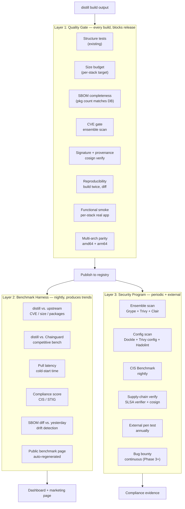
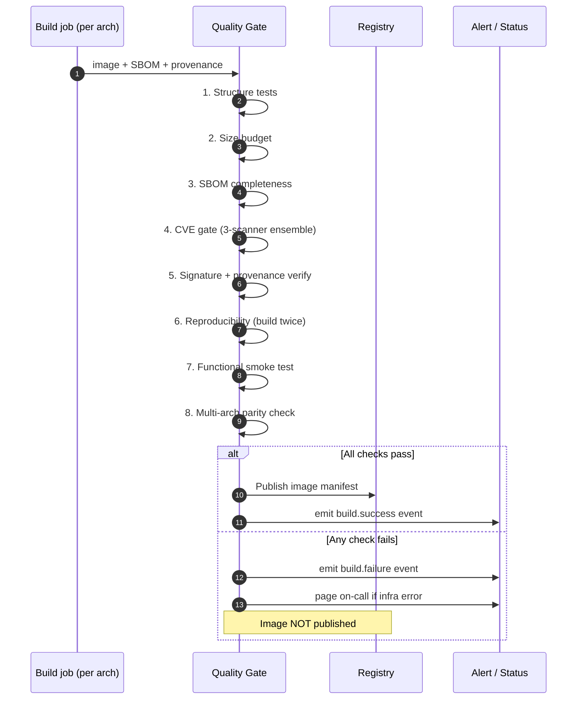

# distill — Testing and Validation Strategy

**Date:** 2026-04-22
**Status:** Draft
**Scope:** Full specification of the test bench for the distill CLI, the
distill Registry, and the images they produce.

---

## Summary

distill's commercial value rests on three assertions:

1. **The images are safer than alternatives** (fewer CVEs, smaller attack surface)
2. **The pipeline produces trustworthy artifacts** (valid SBOMs, verifiable provenance, reproducible builds)
3. **The compliance story is evidence-based** (not aspirational)

Each assertion must be continuously verified. This document specifies the
three-layer test bench that does that: a **Quality Gate** that blocks bad
images from shipping, a **Benchmark Harness** that measures claims
competitively, and a **Security Program** that proactively looks for
weaknesses.

The guiding principle: **every number in a sales conversation must be one
query away from raw, reproducible, time-stamped data.**

---

## Current State (as of 2026-04-22)

| Test type | Status | Coverage |
|---|---|---|
| Go unit tests | Working | 967 lines across `spec`, `builder/dnf`, `builder/apt`, `cmd/image` |
| CLI smoke tests | Working | Help text, exit codes, flag validation in `integration.yml` |
| Image structure tests | Working | `container-structure-test` per example (rhel9, debian, etc.) |
| End-to-end build | Working | 6 example images built in CI; SBOM generated; `grype --fail-on critical` run |
| Markdown + Go lint | Working | `markdownlint` + `golangci-lint` in `ci.yml` |
| Cross-platform build verify | Working | linux+darwin × amd64+arm64 in `ci.yml` |
| **CVE tracking over time** | Missing | One-shot only; no trend data |
| **Image size enforcement** | Missing | README claims ≤30MB but not enforced |
| **Reproducibility verification** | Missing | Claimed as principle but unverified |
| **SBOM completeness check** | Missing | SBOM generated but not validated |
| **Provenance verification** | Missing | `cosign verify` not run in CI |
| **Runtime functional tests** | Minimal | `bash --version` only; nothing stack-specific |
| **Benchmark vs. competitors** | Missing | Strategy's "aha" demo numbers are assumptions |
| **Multi-scanner ensemble** | Missing | Only Grype; no Trivy or Clair |
| **CIS / STIG evaluation** | Missing | No compliance baseline runs |
| **Multi-arch test parity** | Partial | arm64 builds in CI but test matrix is amd64-only |
| **Pen testing** | Missing | No external or automated pen test |

The gap between "developer-level testing" (what exists) and "product-level
testing" (what's needed) is the work this document specifies.

---

## Three-Layer Architecture



---

## Layer 1: The Quality Gate

The quality gate runs on every build of every image. If any check fails, the
image is not published. This is the operational embodiment of the strategy's
commitment that every shipped image meets a minimum bar.

### The eight non-negotiable checks

#### 1. Structure tests (existing)

Uses Google's `container-structure-test` per-image-spec. Verifies:

- No package manager binary (`dnf`, `apt-get`, `dpkg` absent)
- CA certificates present at the distro-correct path
- Non-root `USER` set
- Expected environment variables set (`LANG`, `LC_ALL`)
- No shells beyond the declared one

**Tool:** `container-structure-test` (already integrated in `examples.yml`)
**Action on failure:** Block publish. Block merge if introduced by PR.

#### 2. Size budget

Every image spec declares a target size. Builds exceeding the budget fail.

```yaml
# In .distill.yaml
quality:
  size-budget:
    compressed-mb: 30     # layer size after gzip
    uncompressed-mb: 90   # rootfs size
```

**Tool:** `docker image inspect` + custom Go check
**Rationale:** README claims "≤30MB" for UBI9 runtime. Unenforced claims rot.
**Action on failure:** Block publish.

#### 3. SBOM completeness

Every package listed in the preserved RPM/dpkg database must appear in the
generated SBOM. Any delta is a bug in the SBOM generator or a package the
database doesn't know about (also a bug).

```bash
# Extract package list from image
docker run --rm $IMAGE rpm -qa > rpm-db.txt

# Extract package list from SBOM
jq -r '.packages[].name' sbom.spdx.json > sbom-pkgs.txt

# Diff must be empty
diff <(sort rpm-db.txt) <(sort sbom-pkgs.txt)
```

**Tool:** Syft for generation; custom diff script for verification
**Rationale:** SBOMs with gaps fail compliance audits. Catching gaps at build
time is cheap; discovering them in a customer audit is not.
**Action on failure:** Block publish.

#### 4. CVE gate (ensemble scan)

Every image is scanned by **three** vulnerability scanners. The publish
threshold is: zero critical, zero high from any scanner. Medium-severity
findings are recorded but don't block; low-severity is ignored.

Why three scanners?

| Scanner | CVE data source | Strengths |
|---|---|---|
| **Grype** (Anchore) | Anchore Vulnerability DB (aggregates NVD, GitHub, distro) | Best RPM + dpkg matching |
| **Trivy** (Aqua) | Trivy DB (NVD + distro advisories) | Best OS package detection; fastest |
| **Clair** (Red Hat) | RHSA, Ubuntu, Debian security trackers | Best Red Hat / distro vendor advisories |

Published research shows 15–25% of CVEs are found by only one of the three.
An ensemble is credible; a single scanner is not.

**Tool:** Grype + Trivy + Clair, run in parallel; results aggregated
**Action on failure:** Block publish. Exception process requires documented
justification + expiry date (max 7 days).

#### 5. Signature and provenance verification

After signing, verify the signature and provenance **from scratch**, as a
separate, third-party-toolable workflow. Catches key misconfiguration, KMS
problems, and Sigstore transparency-log issues before customers hit them.

```bash
# Verify Cosign signature
cosign verify --certificate-identity-regexp "https://github.com/damnhandy/distill" \
  --certificate-oidc-issuer https://token.actions.githubusercontent.com \
  $IMAGE

# Verify SBOM attestation
cosign verify-attestation --type spdxjson ... $IMAGE

# Verify SLSA provenance
cosign verify-attestation --type slsaprovenance ... $IMAGE
slsa-verifier verify-image $IMAGE --source-uri github.com/damnhandy/distill
```

**Tool:** Cosign + slsa-verifier
**Action on failure:** Block publish; page on-call if signing infrastructure
appears broken.

#### 6. Reproducibility

The same spec, built twice with the same distill version and the same base
image digest, must produce bit-identical output.

```bash
# Build twice with same inputs
distill build --spec $SPEC --source-digest $DIGEST -o build-a/
distill build --spec $SPEC --source-digest $DIGEST -o build-b/

# Compare
diffoscope build-a/ build-b/ --exit-on-diff
```

**Tool:** `diffoscope` (from the Reproducible Builds project)
**Gotcha:** Daily rebuilds are *not* reproducible across days (packages
change) — only within a single run. The check is "twice in the same minute."
**Action on failure:** Block publish. Investigate — usually indicates embedded
timestamps or non-deterministic ordering.

#### 7. Functional smoke test (per-stack)

Generic image tests ("bash runs") catch 20% of failures. Stack-specific tests
("Spring Boot hello-world starts and returns 200 OK") catch the rest.

Each image stack ships with a minimum functional test:

| Stack | Functional smoke |
|---|---|
| `java21-ubi9` | Runs a packaged Spring Boot jar; `curl /hello` returns 200 |
| `python312-debian` | Installs Flask at runtime, starts server, responds |
| `node22-ubuntu` | Runs an Express app, responds to HTTP |
| `go-static-ubi9` | Runs a pre-built Go binary, responds |
| `.net8-ubi9` | Runs a minimal ASP.NET app, responds |
| `nginx-debian` | Serves a static file, returns correct content |
| `postgres16-ubi9` | Starts, accepts `psql` connection, runs `SELECT 1` |
| `redis7-debian` | Starts, accepts `redis-cli PING`, replies `PONG` |
| `base-ubi9` / `base-debian` | Runs `/bin/sh -c "echo ok"` |

**Tool:** Go test harness + Docker/Podman + `curl`/stack-native clients
**Rationale:** An image that builds but can't actually run its declared
runtime is worse than no image. Catches DNF cleanup that removed a required
file, missing CA certs, wrong user ID, etc.
**Action on failure:** Block publish.

#### 8. Multi-arch parity

Every check above runs for both amd64 and arm64. If either fails, the
manifest is not published.

**Tool:** QEMU + Docker Buildx matrix in CI
**Rationale:** Enterprise customers deploy on both architectures; "arm64
mostly works" is not a shippable state.
**Action on failure:** Block the whole manifest (no partial multi-arch
publishing — it breaks `docker pull` behavior on mixed-arch clusters).

### Quality gate workflow



### Implementation plan

**Phase 1 (months 0–6) — CLI-level gate:**

- Add size-budget field to spec schema
- Write size enforcement check
- Write SBOM completeness verifier
- Add reproducibility verification (`diffoscope` in CI)
- Add `cosign verify` step to existing `examples.yml` workflow
- Write functional smoke tests for each example

**Phase 2 (months 6–12) — Registry-level gate:**

- Port the checks into the registry's build pipeline
- Add Trivy and Clair scanners (alongside existing Grype)
- Per-stack functional tests for the 15 registry stacks
- Exception workflow for documented CVE acceptance
- Quality-gate dashboard (pass/fail per image per day)

### New CLI commands

The quality gate is useful as a local command, not just a CI step:

```bash
# Run the full quality gate locally on an image
distill verify <image>

# Run specific checks
distill verify <image> --check size,sbom,cve
distill verify <image> --check reproducibility

# JSON output for CI integration
distill verify <image> --format json
```

---

## Layer 2: The Benchmark Harness

The quality gate answers "is this image shippable?" The benchmark harness
answers "is this image better than the alternatives?" Nightly, reproducible,
publicly-auditable measurements.

### What gets measured

For every distill image in the registry, and for each competitor image, the
harness records:

| Metric | Units | Why |
|---|---|---|
| **CVE count by severity** | count (critical/high/medium/low) | The primary marketing number |
| **Package count** | integer | Proxy for attack surface |
| **Compressed size** | MB | Pull time, registry storage cost |
| **Uncompressed size** | MB | Disk footprint on nodes |
| **Layer count** | integer | OCI manifest complexity |
| **Pull latency (cold)** | seconds | From empty cache to ready |
| **Container start time** | ms | From `docker run` to PID 1 responsive |
| **Memory footprint (idle)** | MB | Baseline memory cost |
| **CIS Benchmark score** | % passing | Compliance story |
| **Reproducibility** | pass/fail | Build twice, diff |
| **SBOM package count** | integer | Cross-check with RPM/dpkg DB |
| **Signed + verifiable** | pass/fail | Trust chain intact |

### What we compare against

| Competitor image | For which distill image |
|---|---|
| `registry.access.redhat.com/ubi9/ubi` | `base-ubi9` |
| `registry.access.redhat.com/ubi9/ubi-minimal` | `base-ubi9` |
| `registry.access.redhat.com/ubi9/ubi-micro` | `base-ubi9` |
| `debian:bookworm-slim` | `base-debian` |
| `ubuntu:24.04` | `base-ubuntu` |
| `eclipse-temurin:21-jre` | `java21-ubi9`, `java21-debian` |
| `python:3.12-slim` | `python312-debian` |
| `node:22-slim` | `node22-ubuntu` |
| `cgr.dev/chainguard/jre` (Chainguard free tier) | `java21-ubi9` |
| `cgr.dev/chainguard/python` | `python312-debian` |
| `cgr.dev/chainguard/node` | `node22-ubuntu` |
| `cgr.dev/chainguard/nginx` | `nginx-debian` |
| `cgr.dev/chainguard/postgres` | `postgres16-ubi9` |
| Google distroless (where applicable) | `java21-*`, `python312-*`, `node22-*` |

### The methodology is published

Credibility requires transparency. The benchmark page publishes:

- **Exact commands** used to produce each number
- **Scanner versions and CVE database timestamps** (CVE counts change as
  databases update; a number without a timestamp is meaningless)
- **Image digests** (so anyone can re-run against the exact image tested)
- **Raw JSON output** from each scanner (not just aggregated totals)
- **Run timestamp + runner environment** (CPU, memory, region)

If a competitor can reproduce our numbers, the numbers are trustworthy. If
they can't, either their setup differs (publish the diff) or our numbers are
wrong (fix them). Either way, the public methodology creates accountability.

### The public benchmark page

Auto-regenerated from nightly runs:

```
https://distill.dev/benchmarks
├─ Overview (headline numbers)
├─ Per-stack detail pages
│  ├─ java21-ubi9
│  │  ├─ CVE count over 30 days (sparkline)
│  │  ├─ vs. Red Hat UBI9 Java
│  │  ├─ vs. Chainguard Java
│  │  ├─ vs. eclipse-temurin:21-jre
│  │  └─ Raw data: benchmarks/2026-04-22/java21-ubi9.json
│  ├─ python312-debian
│  ├─ ... (15 stacks)
│  └─ base-ubi9
├─ Methodology
├─ Archive (historical runs)
└─ Reproducibility guide
```

This page becomes the single most effective sales asset. Every prospect
visits it. Every objection ("how is this different from Chainguard?") is
answered with measured data.

### Storage and query

Nightly runs produce ~50MB of data (raw scan output, SBOMs, timings).
Retention and query:

- **Raw JSON per run** in S3, keyed by date + stack
- **Aggregated metrics** in a time-series store (Prometheus / InfluxDB /
  Postgres with `tstzrange`)
- **Grafana dashboards** for internal trend analysis
- **Static site generator** regenerates public benchmark page from
  aggregated store

### Benchmark workflow

```mermaid
sequenceDiagram
    autonumber
    participant CRON as Nightly Trigger
    participant ORC as Benchmark Orchestrator
    participant SCAN as Scanner Pool<br/>(Grype + Trivy + Clair)
    participant RUN as Runtime Tester<br/>(Docker + stopwatch)
    participant STORE as Metrics Store
    participant SITE as Static Site Generator

    CRON->>ORC: 02:00 UTC daily
    ORC->>ORC: Pull all distill images + competitor images

    par For each image
        ORC->>SCAN: Scan with Grype, Trivy, Clair
        SCAN-->>ORC: CVE counts + raw JSON
    and
        ORC->>RUN: Measure pull time, start time, memory
        RUN-->>ORC: Timing data
    and
        ORC->>SCAN: CIS Benchmark eval
        SCAN-->>ORC: Compliance score
    end

    ORC->>STORE: Write raw + aggregated metrics
    STORE->>SITE: Regenerate public benchmark page
    SITE-->>ORC: Updated site deployed
    ORC->>ORC: Detect regressions vs. last 7 days
    alt Regression detected
        ORC->>ORC: Page on-call; open triage ticket
    end
```

---

## Layer 3: Security Program

Security testing is not a point-in-time activity — it runs at multiple
cadences, each catching a different class of problem.

### Automated — every build

| Tool | What it catches | Action on finding |
|---|---|---|
| **Grype + Trivy + Clair** (ensemble) | Known CVEs in packages | Block at critical/high (quality gate #4) |
| **Dockle** | Container best-practices violations | Block at FATAL; record WARN |
| **Trivy config** | Insecure defaults (root user, missing healthcheck, etc.) | Block at CRITICAL |
| **Hadolint** | Dockerfile anti-patterns (we generate Dockerfiles, so this checks our own output) | Warn; fix in CLI |
| **cosign verify** | Signing chain broken | Block publish |
| **slsa-verifier** | Provenance invalid | Block publish |
| **SBOM diff vs. previous build** | Unexpected package additions | Flag for review |

### Automated — nightly

| Tool | What it catches | Action on finding |
|---|---|---|
| **CIS Docker Benchmark** | Config drift from hardening baseline | Record score; regression alerts |
| **CIS Kubernetes Benchmark** (for registry infra) | Registry deployment drift | Record score; regression alerts |
| **STIG Container Profile** | DoD hardening compliance | Record score; required for Sovereign tier |
| **SBOM diff vs. 7 days ago** | Supply-chain drift | Review any new transitive packages |
| **Signature expiry check** | Fulcio cert or TSA timestamps approaching expiry | Rotate; alert |

### Automated — weekly

| Tool | What it catches |
|---|---|
| **Dependency update scan** (Dependabot / Renovate) | Direct dep updates for the CLI and registry code |
| **Transitive dep budget audit** | Transitive fan-out regressions |
| **SBOM bit-rot scan** | Packages that were CVE-free at publish but now have CVEs |
| **Seccomp profile coverage** | Syscalls observed in runtime tests vs. seccomp profile |

### External — annual + continuous

#### Annual pen test (Phase 3+)

External firm engagement. Scope includes:

- Registry control plane (authentication, authorization, rate limiting)
- Build pipeline (can a malicious spec poison another customer's image?)
- Signing infrastructure (key management, Sigstore integration)
- Supply chain (can an attacker replace a legitimate image?)
- Customer data isolation (Team/Enterprise tenancy)

Firms with relevant expertise: NCC Group, Trail of Bits, Bishop Fox, Kudelski
Security. Budget: $75–150k per engagement.

Deliverables:
- Full technical report (confidential)
- Executive summary (shareable with customers under NDA)
- Public summary (shareable openly; demonstrates maturity)

#### Continuous — bug bounty (Phase 3+)

Scoped program on HackerOne or Intigriti. Initial scope:

- distill CLI binary (supply-chain integrity, signing)
- `registry.distill.dev` (authentication, authorization, tenant isolation)
- Published images (must identify specific CVE not caught by ensemble scan)

Reward tiers:
- Critical: $5,000–$15,000
- High: $2,000–$5,000
- Medium: $500–$2,000
- Low: $100–$500

### Threat-modeled test cases

Specific attack scenarios the security program must catch:

| Threat | Test |
|---|---|
| Poisoned upstream package | Inject a known-bad package in staging; verify ensemble scan catches it |
| Malicious spec submission (Enterprise custom specs) | Fuzz the spec parser; attempt command injection via spec fields |
| Cross-tenant image access | Attempt to pull another customer's custom image; verify 403 |
| Signing key compromise simulation | Annually rotate keys; verify old images still verify via transparency log |
| SBOM tampering | Modify an SBOM after publish; verify signature check rejects it |
| Registry DDoS | Load test with 10x expected traffic; verify rate-limits trigger |
| Build pipeline escape | Attempt to read /host or access adjacent build from a malicious spec |
| Transparency-log outage | Simulate Sigstore downtime; verify graceful degradation |

Each test is codified, versioned, and re-run on every major release.

---

## Test Matrix — What Runs When

| Test | On PR | On merge | On nightly | On release | Weekly | Annually |
|---|---|---|---|---|---|---|
| Go unit tests | ✓ | ✓ | | ✓ | | |
| Go lint | ✓ | ✓ | | ✓ | | |
| Markdown lint | ✓ | ✓ | | ✓ | | |
| CLI smoke tests | ✓ | ✓ | | ✓ | | |
| Example image builds | ✓ | ✓ | ✓ | ✓ | | |
| Structure tests | ✓ | ✓ | ✓ | ✓ | | |
| Size budget | ✓ | ✓ | ✓ | ✓ | | |
| SBOM completeness | ✓ | ✓ | ✓ | ✓ | | |
| Ensemble CVE scan | ✓ | ✓ | ✓ | ✓ | | |
| Signature + provenance verify | | ✓ | ✓ | ✓ | | |
| Reproducibility | | ✓ | ✓ | ✓ | | |
| Functional smoke (per stack) | ✓ | ✓ | ✓ | ✓ | | |
| Multi-arch parity | | ✓ | ✓ | ✓ | | |
| Dockle + Trivy config | ✓ | ✓ | ✓ | ✓ | | |
| Benchmark vs. competitors | | | ✓ | | | |
| CIS Benchmark | | | ✓ | | | |
| STIG profile eval | | | ✓ | | | |
| SBOM drift detection | | | ✓ | | | |
| Dependency update scan | | | | | ✓ | |
| Seccomp profile review | | | | | ✓ | |
| External pen test | | | | | | ✓ |

---

## File Layout

Proposed additions to the repo:

```
test/
├── bench/                          # Benchmark harness (Layer 2)
│   ├── runner.go                   # Orchestrates nightly benchmark
│   ├── competitors.yaml            # List of competitor images to compare
│   ├── metrics/                    # Individual metric collectors
│   │   ├── cve.go                  # Runs Grype + Trivy + Clair
│   │   ├── size.go                 # Compressed + uncompressed size
│   │   ├── timing.go               # Pull + start + memory
│   │   └── compliance.go           # CIS + STIG runners
│   └── site/                       # Static site generator
│       └── templates/              # Public benchmark page templates
├── functional/                     # Per-stack smoke tests (Layer 1 #7)
│   ├── java21/
│   │   ├── Dockerfile.test         # Builds test app
│   │   ├── hello.jar               # Tiny Spring Boot app
│   │   └── run.sh                  # Start + curl + assert
│   ├── python312/
│   │   ├── app.py
│   │   └── run.sh
│   ├── node22/
│   ├── go-static/
│   ├── dotnet8/
│   ├── nginx/
│   ├── postgres16/
│   ├── redis7/
│   └── base/
├── compliance/                     # CIS + STIG runners (Layer 3)
│   ├── cis-docker.sh
│   ├── cis-kubernetes.sh
│   └── stig-container.sh
├── reproducibility/                # Build-twice-and-diff (Layer 1 #6)
│   └── verify.sh
├── security/                       # Threat-modeled test cases (Layer 3)
│   ├── poisoned-package/
│   ├── tenant-isolation/
│   ├── sbom-tampering/
│   └── pipeline-escape/
└── README.md                       # How to run each layer locally

.github/workflows/
├── ci.yml                          # (existing) unit + lint
├── integration.yml                 # (existing) CLI smoke
├── examples.yml                    # (existing) → extend with quality gate
├── benchmark.yml                   # NEW: nightly benchmark harness
├── security-weekly.yml             # NEW: weekly deep scans
└── compliance-nightly.yml          # NEW: CIS + STIG nightly
```

---

## New distill CLI Commands

The test bench exposes capabilities to end users, not just CI:

```bash
# Layer 1: run the quality gate locally
distill verify <image>
distill verify --spec image.distill.yaml --check size,sbom,cve,reproducibility
distill verify <image> --format json > verify.json

# Layer 2: run a benchmark comparison
distill bench <image> --compare registry.access.redhat.com/ubi9/ubi
distill bench --stack java21 --nightly  # runs the full comparison set

# SBOM tooling
distill sbom diff <image-a> <image-b>
distill sbom verify <image>  # completeness check

# Reproducibility
distill build --spec image.distill.yaml --reproducibility-check
# builds twice, diffs, exits non-zero if output differs
```

These commands give Enterprise customers running self-hosted pipelines the
same verification capability the hosted registry gets.

---

## Compliance Evidence Mapping

The test bench outputs are also compliance evidence. This table maps what the
test bench produces to what auditors ask for.

| Framework | Control | Evidence source |
|---|---|---|
| **SOC 2 CC7.1** (detect security events) | Ensemble scan output, alerts on CVE findings | Layer 1 #4 + Layer 3 automated |
| **SOC 2 CC7.2** (monitor system components) | Nightly benchmark + CIS Benchmark output | Layer 2 + Layer 3 nightly |
| **SOC 2 CC8.1** (change management) | Reproducibility verification + SBOM diff | Layer 1 #6 + Layer 3 weekly |
| **FedRAMP SI-2** (flaw remediation) | CVE gate + 48-hour patch SLA | Layer 1 #4 + operational SLO |
| **FedRAMP SI-3** (malicious code protection) | Ensemble scan + SBOM completeness | Layer 1 #3 + #4 |
| **FedRAMP SA-11** (developer security testing) | Weekly dep scan + annual pen test | Layer 3 weekly + annual |
| **FedRAMP CM-6** (configuration settings) | CIS Benchmark runs | Layer 3 nightly |
| **PCI DSS 6.3.2** (code review for vulnerabilities) | Go lint + static analysis + CVE gate | CI + Layer 1 #4 |
| **PCI DSS 11.3** (penetration testing) | Annual external pen test | Layer 3 annual |
| **DISA STIG V-235796** (no unauthorized services) | Structure tests (no package manager, etc.) | Layer 1 #1 |
| **CIS Docker 4.6** (HEALTHCHECK) | Trivy config check | Layer 3 automated |
| **CIS Docker 5.29** (non-root user) | Structure test | Layer 1 #1 |

Auditors care about **continuous evidence**, not snapshots. The test bench
produces timestamped, signed, queryable output for every framework control
the distill product touches.

---

## Implementation Roadmap

### Phase 1 — CLI-level quality gate (months 0–3)

Extend existing CI with Layer 1 checks:

- Size budget field in spec schema + enforcement
- SBOM completeness verifier
- `cosign verify` step in `examples.yml`
- `diffoscope` reproducibility check
- Per-example functional smoke test
- `distill verify` CLI command

**Effort:** ~2 engineer-weeks
**Exit criteria:** Every example image in CI passes all 8 quality-gate checks.

### Phase 2 — Registry quality gate + benchmark harness (months 6–9)

Port Layer 1 to the registry build pipeline, add Layer 2:

- Trivy and Clair scanners alongside Grype
- Per-stack functional tests for 15 registry stacks
- Nightly benchmark harness (distill vs. upstream vs. Chainguard)
- Public benchmark page
- Grafana dashboards for internal trend analysis

**Effort:** ~1 engineer-month (dedicated) + 0.5 ongoing
**Exit criteria:** Public benchmark page live with 30 days of trend data;
every registry image passes quality gate before publish.

### Phase 3 — Security program (months 12–18)

Add Layer 3 external elements:

- CIS Benchmark automation (nightly)
- STIG profile evaluation
- Threat-modeled test cases
- First external pen test
- Bug bounty program launch

**Effort:** ~0.5 FTE ongoing + $150k for pen test + $30k/year for bug bounty
**Exit criteria:** Pen test report complete; bug bounty live; CIS scores
published; SOC 2 Type II audit has evidence from test bench.

### Phase 4 — Sovereign (months 18+)

Enhancements for FedRAMP / air-gapped:

- FIPS-validated scanner ensemble
- Offline benchmark runs (for air-gapped verification)
- Federal STIG profile runs
- FedRAMP-specific evidence package generation

---

## Open Questions

1. **Scanner disagreement policy.** When Grype says critical but Trivy says
   high, do we publish? Proposed: block at max(severities) from any scanner.
   Alternatives worth evaluating.
2. **Reproducibility across architectures.** amd64 and arm64 builds produce
   different binaries by definition. The reproducibility check is same-arch
   only — do we also need an arch-independence check?
3. **Benchmark fairness.** Is it fair to compare `ubi9/ubi` (which includes
   development tools) to `base-ubi9` (which doesn't)? Proposed: publish
   multiple comparisons — vs. `ubi`, vs. `ubi-minimal`, vs. `ubi-micro` — and
   let readers choose. Transparency over cherry-picking.
4. **Competitor TOS.** Chainguard's TOS may restrict benchmark publication.
   Verify before launching the public benchmark page.
5. **CVE database freshness.** If a new CVE drops mid-day, should images
   already published be retroactively flagged? Proposed: yes, via dashboard
   only (not re-gated); rebuild within SLA.
6. **Functional test maintenance.** 15 stacks × per-version updates is
   non-trivial maintenance. Can per-stack tests be generated from a template?
7. **Pen test findings disclosure.** Public summary helps sales but may
   signal attack surface. Proposed: follow typical maturity — publish summary
   with remediation status; keep technical detail confidential.

---

## Summary — Why This Matters

Three principles drove this design:

1. **Every claim is a commitment.** The strategy promises "85% fewer CVEs,"
   "signed provenance on every image," "reproducible builds." Each is
   verified, continuously, by the test bench. Unverified claims rot.

2. **Testing is the marketing engine.** The benchmark harness doesn't just
   catch regressions — it produces the numbers sales uses, the dashboards
   customers trust, and the evidence auditors require. One system, three
   audiences.

3. **Compliance evidence is a byproduct, not an afterthought.** Auditors
   want queryable, timestamped, signed data — exactly what the test bench
   produces. Organizations that treat compliance as a separate workstream
   spend 10x more on audits than those that treat it as the natural output
   of rigorous engineering.

The test bench is not overhead. It is the product.
